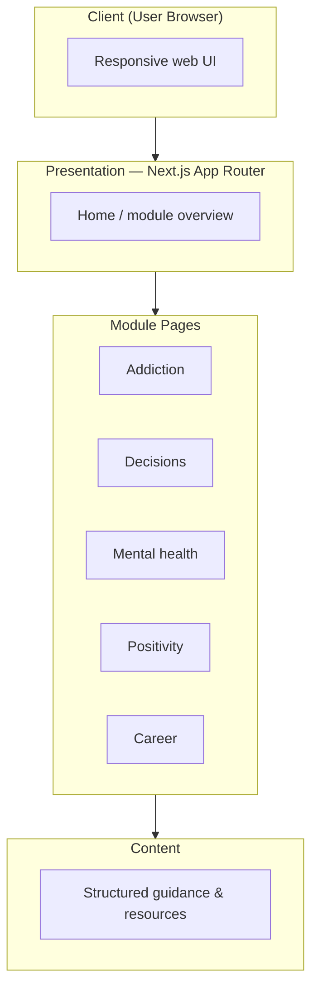
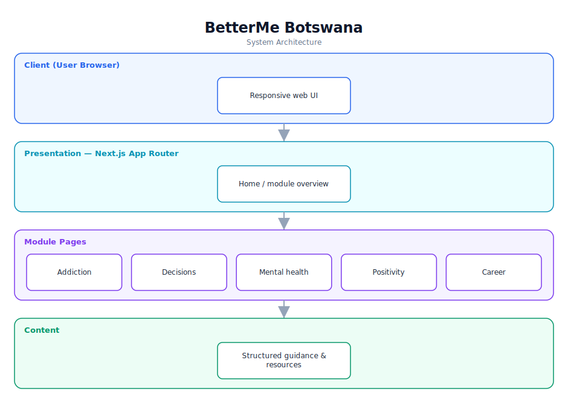

# BetterMe Botswana — Software Documentation

> A youth wellbeing web app covering addiction recovery, mental health, decisions, positivity, and careers.

**Repository:** [`betterme-app`](https://github.com/Monametsi-s/betterme-app)  
**Type:** Content-driven web application  
**Status:** Complete / functional

---

## 1. Overview

BetterMe Botswana is a Next.js web application designed to support teens and young adults in Botswana. It is organised into five guidance modules — addiction recovery, smart decision-making, mental health, positivity, and career guidance — each delivered as a structured content page. The current build is primarily static, server-rendered content with room to add interactivity.

## 2. System Architecture

The diagram below shows the high-level architecture and how data flows between layers. It renders automatically on GitHub (Mermaid) and is also committed as a vector image ([`architecture.svg`](architecture.svg)).



<p align="center"></p>

### 2.1 Component responsibilities

| Layer | Responsibility |
|---|---|
| **Client** | Renders responsive pages for users on any device. |
| **Presentation (Next.js)** | App Router layout and home page linking to each module. |
| **Module pages** | Five themed guidance modules. |
| **Content** | Curated educational content and local resources. |

## 3. Technology Stack

| Area | Technology |
|---|---|
| Framework | Next.js 15 |
| Language | TypeScript |
| Styling | Tailwind CSS |
| Linting | ESLint |
| Deployment | Vercel |

## 4. Assumed User Requirements

_These requirements are inferred from the project's purpose and feature set; they document the intended behaviour rather than a formally agreed specification._

### 4.1 Functional requirements

- **FR-01** — Present a home page summarising the five support modules.
- **FR-02** — Provide a dedicated page for each module with practical guidance.
- **FR-03** — Offer a structured decision-making framework and stress-management techniques.
- **FR-04** — Surface Botswana-specific resources and career guidance.
- **FR-05** — Render responsively for mobile-first users.

### 4.2 Representative user stories

- As a young person facing a tough choice, I want a simple framework to think it through.
- As a user struggling with stress, I want practical techniques I can try now.
- As a job seeker, I want guidance tailored to Botswana's market.

### 4.3 Non-functional requirements

- Content must be accessible and readable on low-end mobile devices.
- Any wellbeing resources must be accurate and current.
- Pages should load quickly on limited bandwidth.

## 5. Assumed System Requirements

### 5.1 End-user (runtime) requirements

- A modern desktop or mobile web browser (latest Chrome, Edge, Firefox, or Safari) with JavaScript enabled.
- A stable internet connection for the initial page load.

### 5.2 Server / hosting requirements

- A Vercel or Node-compatible host for the Next.js app (static/SSR).

### 5.3 External services & API keys

- None — the application has no third-party service dependencies at runtime.

### 5.4 Developer / build requirements

- Node.js 18+ and npm (or yarn/pnpm).
- Git for cloning the repository.
- A code editor such as VS Code (recommended).

## 6. Setup & Installation

```bash
git clone https://github.com/Monametsi-s/betterme-app.git
cd betterme-app
npm install
npm run dev
```

## 7. Assumptions & Future Considerations

- Add interactivity: mood check-ins, saved favourites, progress tracking.
- Integrate verified local helpline directories.
- Add multilingual (Setswana/English) content.

---

<sub>This document was generated as part of a portfolio-wide documentation pass. User and system requirements are **assumed** from the codebase, README, and project intent, and should be validated against real product goals before being treated as authoritative.</sub>
